# Visual Guide to iSamples Edge Types

This document provides visual representations of the iSamples property graph structure using diagrams and charts.

## Table of Contents

1. [Complete Entity Relationship Diagram](#complete-entity-relationship-diagram)
2. [Edge Type Matrix](#edge-type-matrix)
3. [Sample-Centric View](#sample-centric-view)
4. [Event-Centric View](#event-centric-view)
5. [Graph Traversal Examples](#graph-traversal-examples)
6. [Edge Type Heatmap](#edge-type-heatmap)
7. [Storage Structure Diagram](#storage-structure-diagram)

---

## Complete Entity Relationship Diagram

This diagram shows all 8 entity types and the 14 relationship types (predicates) connecting them.

```mermaid
graph TB
    MSR[MaterialSampleRecord<br/>📋 Sample]
    Event[SamplingEvent<br/>🎯 Collection Event]
    Site[SamplingSite<br/>📍 Named Location]
    Coords[GeospatialCoordLocation<br/>🌍 Coordinates]
    Concept[IdentifiedConcept<br/>🏷️ Vocabulary Term]
    Agent[Agent<br/>👤 Person/Organization]
    Curation[MaterialSampleCuration<br/>📦 Repository Info]
    Relation[SampleRelation<br/>🔗 Sample Links]

    MSR -->|produced_by| Event
    MSR -->|has_material_category| Concept
    MSR -->|has_context_category| Concept
    MSR -->|has_sample_object_type| Concept
    MSR -->|keywords| Concept
    MSR -->|registrant| Agent
    MSR -->|curation| Curation
    MSR -->|related_resource| Relation

    Event -->|sampling_site| Site
    Event -->|sample_location| Coords
    Event -->|has_context_category| Concept
    Event -->|responsibility| Agent

    Site -->|site_location| Coords

    Curation -->|responsibility| Agent

    classDef core fill:#e1f5ff,stroke:#0077be,stroke-width:3px
    classDef event fill:#fff4e1,stroke:#ff8c00,stroke-width:2px
    classDef location fill:#e8f5e9,stroke:#4caf50,stroke-width:2px
    classDef vocab fill:#f3e5f5,stroke:#9c27b0,stroke-width:2px
    classDef supporting fill:#fce4ec,stroke:#e91e63,stroke-width:2px

    class MSR core
    class Event event
    class Site,Coords location
    class Concept vocab
    class Agent,Curation,Relation supporting
```



**Legend:**
- **📋 MaterialSampleRecord (blue):** The physical sample - central entity
- **🎯 SamplingEvent (orange):** When/how the sample was collected
- **📍 SamplingSite (green):** Named locations (e.g., "Çatalhöyük")
- **🌍 GeospatialCoordLocation (green):** Latitude/longitude coordinates
- **🏷️ IdentifiedConcept (purple):** Controlled vocabulary terms
- **👤 Agent (pink):** People and organizations
- **📦 MaterialSampleCuration (pink):** Repository/archive information
- **🔗 SampleRelation (pink):** Links between related samples

---

## Edge Type Matrix

This table shows which entity types (subjects) connect to which entity types (objects) via which predicates.

| **Subject Type** | **Predicate** | **Object Type** | **Multivalued** | **Required** |
|------------------|---------------|-----------------|-----------------|--------------|
| MaterialSampleRecord | `produced_by` | SamplingEvent | No | Yes |
| MaterialSampleRecord | `has_material_category` | IdentifiedConcept | Yes | No |
| MaterialSampleRecord | `has_context_category` | IdentifiedConcept | Yes | No |
| MaterialSampleRecord | `has_sample_object_type` | IdentifiedConcept | Yes | No |
| MaterialSampleRecord | `keywords` | IdentifiedConcept | Yes | No |
| MaterialSampleRecord | `registrant` | Agent | No | No |
| MaterialSampleRecord | `curation` | MaterialSampleCuration | No | No |
| MaterialSampleRecord | `related_resource` | SampleRelation | Yes | No |
| SamplingEvent | `sampling_site` | SamplingSite | No | No |
| SamplingEvent | `sample_location` | GeospatialCoordLocation | No | No |
| SamplingEvent | `has_context_category` | IdentifiedConcept | Yes | No |
| SamplingEvent | `responsibility` | Agent | Yes | No |
| SamplingSite | `site_location` | GeospatialCoordLocation | No | No |
| MaterialSampleCuration | `responsibility` | Agent | Yes | No |

**Total:** 14 edge types forming the complete iSamples grammar

---

## Sample-Centric View

This diagram focuses on relationships emanating from a MaterialSampleRecord (the core entity).


**Key observations:**
- **Only `produced_by` is required** - every sample MUST link to a SamplingEvent
- **Multiple keywords** can be assigned (multivalued)
- **IdentifiedConcept used 4 different ways** - material, context, object type, keywords
- **3 relationship types to IdentifiedConcept** enable rich categorization

---

## Event-Centric View

This diagram shows how SamplingEvent acts as a bridge between samples and location/collector information.


**Key observations:**
- **Multiple samples** can share the same SamplingEvent (batch collection)
- **Two paths to coordinates:** Event location (specific) vs Site location (general)
- **Multiple agents** can be responsible for an event (multivalued)
- **Event bridges samples to context** - who, when, where

---

## Graph Traversal Examples

### Example 1: Find Sample Coordinates (2-hop traversal)


**SQL Pattern:**
```sql
SELECT sample.*, coords.*
FROM pqg AS sample
JOIN pqg AS edge1 ON edge1.s = sample.row_id AND edge1.p = 'produced_by'
JOIN pqg AS event ON event.row_id = ANY(edge1.o)
JOIN pqg AS edge2 ON edge2.s = event.row_id AND edge2.p = 'sample_location'
JOIN pqg AS coords ON coords.row_id = ANY(edge2.o)
```

### Example 2: Find Sample Site Name (3-hop traversal)


**SQL Pattern:**
```sql
SELECT sample.*, site.label AS site_name, coords.*
FROM pqg AS sample
JOIN pqg AS edge1 ON edge1.s = sample.row_id AND edge1.p = 'produced_by'
JOIN pqg AS event ON event.row_id = ANY(edge1.o)
JOIN pqg AS edge2 ON edge2.s = event.row_id AND edge2.p = 'sampling_site'
JOIN pqg AS site ON site.row_id = ANY(edge2.o)
JOIN pqg AS edge3 ON edge3.s = site.row_id AND edge3.p = 'site_location'
JOIN pqg AS coords ON coords.row_id = ANY(edge3.o)
```

### Example 3: Find Sample Collector (2-hop traversal)


**SQL Pattern:**
```sql
SELECT sample.*, agent.*
FROM pqg AS sample
JOIN pqg AS edge1 ON edge1.s = sample.row_id AND edge1.p = 'produced_by'
JOIN pqg AS event ON event.row_id = ANY(edge1.o)
JOIN pqg AS edge2 ON edge2.s = event.row_id AND edge2.p = 'responsibility'
JOIN pqg AS agent ON agent.row_id = ANY(edge2.o)
```

### Example 4: Find Repository Curator (2-hop traversal)


**SQL Pattern:**
```sql
SELECT sample.*, curation.*, curator.*
FROM pqg AS sample
JOIN pqg AS edge1 ON edge1.s = sample.row_id AND edge1.p = 'curation'
JOIN pqg AS curation ON curation.row_id = ANY(edge1.o)
JOIN pqg AS edge2 ON edge2.s = curation.row_id AND edge2.p = 'responsibility'
JOIN pqg AS curator ON curator.row_id = ANY(edge2.o)
```

---

## Edge Type Heatmap

This matrix shows the "connectivity density" between entity types in the OpenContext dataset.

### Actual Edge Counts (OpenContext Dataset - 11.6M total records)

| **From/To** | **Material<br/>Sample<br/>Record** | **Sampling<br/>Event** | **Sampling<br/>Site** | **Geospatial<br/>Coord<br/>Location** | **Identified<br/>Concept** | **Agent** | **Material<br/>Sample<br/>Curation** | **Sample<br/>Relation** |
|-------------|:----------------------------------:|:----------------------:|:---------------------:|:--------------------------------------:|:--------------------------:|:---------:|:------------------------------------:|:-----------------------:|
| **MaterialSampleRecord** | - | 🔥🔥🔥<br/>1.1M | - | - | 🔥🔥🔥🔥🔥<br/>9.4M | ❄️<br/>~1K | ❄️<br/>~1K | ❄️<br/>~1K |
| **SamplingEvent** | - | - | 🔥🔥<br/>384K | 🔥🔥🔥<br/>1.1M | 🔥🔥🔥<br/>1.1M | 🔥<br/>73K | - | - |
| **SamplingSite** | - | - | - | 🔥🔥<br/>384K | - | - | - | - |
| **MaterialSampleCuration** | - | - | - | - | - | ❄️<br/>~1K | - | - |

**Legend:**
- 🔥🔥🔥🔥🔥 = >5M edges (ultra-dense)
- 🔥🔥🔥 = 1M-5M edges (very dense)
- 🔥🔥 = 100K-1M edges (dense)
- 🔥 = 10K-100K edges (moderate)
- ❄️ = <10K edges (sparse)
- `-` = 0 edges (no relationship)

**Key insights:**
1. **MaterialSampleRecord → IdentifiedConcept** is the densest relationship (9.4M edges)
   - Includes: material categories, context categories, object types, keywords
2. **MaterialSampleRecord → SamplingEvent** is critical infrastructure (1.1M edges)
   - Required relationship - every sample has exactly one event
3. **Event → Coordinates** enables geospatial queries (1.1M edges)
4. **Curation and Relation** are rarely used in OpenContext data
   - More common in geology (SESAR) and biology (GEOME) domains

---

## Storage Structure Diagram

This diagram shows how entities and edges are stored in the unified PQG table.


**How it works:**
1. **Entity rows** have `otype` set to their entity type (e.g., `MaterialSampleRecord`)
2. **Edge rows** have `otype = '_edge_'`
3. **Edge `s` field** points to subject entity's `row_id`
4. **Edge `p` field** contains the predicate name (e.g., `produced_by`)
5. **Edge `o` field** is an **array** of object entity `row_id`s (supports multivalued)
6. **Joining** requires matching `edge.s = subject.row_id` and `object.row_id = ANY(edge.o)`

---

## Predicate Usage Patterns

This chart shows how often each predicate appears in the OpenContext dataset.


**Domain patterns:**
- **OpenContext (archaeology):** Heavy use of categorization (material, context, object type)
- **SESAR (geology):** More use of `curation` and `registrant` (institutional tracking)
- **GEOME (biology):** Heavy use of `related_resource` (parent-child sample chains)

---

## Multi-Hop Traversal Map

This diagram shows common multi-hop query patterns and their path lengths.


**Path complexity:**
- **1-hop queries:** Direct attributes (material, context, keywords, registrant)
- **2-hop queries:** Location, collector, site name (most common complex queries)
- **3-hop queries:** Site coordinates (rare - usually use event coordinates instead)

---

## Entity Type Connectivity

This diagram shows how "connected" each entity type is (number of relationship types it participates in).

```mermaid
graph LR
    subgraph "Highly Connected (Hub Nodes)"
        MSR["MaterialSampleRecord<br/>8 outgoing edge types<br/>📊 Centrality: HIGH"]
        Event["SamplingEvent<br/>4 outgoing edge types<br/>📊 Centrality: HIGH"]
    end

    subgraph "Moderately Connected"
        Site["SamplingSite<br/>1 outgoing edge type<br/>📊 Centrality: MEDIUM"]
        Curation["MaterialSampleCuration<br/>1 outgoing edge type<br/>📊 Centrality: MEDIUM"]
    end

    subgraph "Leaf Nodes (No Outgoing Edges)"
        Concept["IdentifiedConcept<br/>0 outgoing<br/>5 incoming edge types<br/>📊 Centrality: HIGH (target)"]
        Agent["Agent<br/>0 outgoing<br/>3 incoming edge types<br/>📊 Centrality: MEDIUM (target)"]
        Coords["GeospatialCoordLocation<br/>0 outgoing<br/>2 incoming edge types<br/>📊 Centrality: MEDIUM (target)"]
        Relation["SampleRelation<br/>0 outgoing<br/>1 incoming edge type<br/>📊 Centrality: LOW (target)"]
    end

    style MSR fill:#c62828,color:#fff
    style Event fill:#f57c00,color:#fff
    style Site fill:#fbc02d
    style Curation fill:#fbc02d
    style Concept fill:#9c27b0,color:#fff
    style Agent fill:#7b1fa2,color:#fff
    style Coords fill:#7b1fa2,color:#fff
    style Relation fill:#aed581
```



**Key observations:**
1. **MaterialSampleRecord** is the primary hub (8 outgoing relationship types)
2. **SamplingEvent** is secondary hub (4 outgoing relationship types)
3. **IdentifiedConcept** is most popular target (5 different incoming predicates)
4. **Agent, Coords** are intermediate targets (2-3 incoming predicates each)
5. **SampleRelation** is rarely used (1 incoming predicate, sparse in data)

---

## The 14 Sentence Types (Grammar Summary)

Visual summary of the complete iSamples "grammar":


**Total:** 14 edge types = Complete grammar of iSamples property graphs

---

## Cross-Domain Comparison

How different scientific domains use the 14 edge types:


**Why different patterns?**
- **Archaeology:** Heavy emphasis on discovery/publication (keywords, object types)
- **Geology:** Institutional tracking (registrants, repositories, curators)
- **Biology:** Sample lineage (parent-child relationships via related_resource)
- **All domains:** Need material classification and geographic coordinates

---

## Graph Query Complexity Chart

This chart shows the complexity distribution of common queries:

| **Query Type** | **Hops** | **Joins** | **Complexity** | **Example** |
|----------------|:--------:|:---------:|:--------------:|-------------|
| Get sample label | 0 | 0 | ⭐ | `SELECT label FROM pqg WHERE pid=?` |
| Get material category | 1 | 2 | ⭐⭐ | Sample → Category |
| Get sample coordinates | 2 | 4 | ⭐⭐⭐ | Sample → Event → Coords |
| Get collector name | 2 | 4 | ⭐⭐⭐ | Sample → Event → Agent |
| Get site name | 2 | 4 | ⭐⭐⭐ | Sample → Event → Site |
| Get site coordinates | 3 | 6 | ⭐⭐⭐⭐ | Sample → Event → Site → Coords |
| Get all related samples | 2-4 | 4-8 | ⭐⭐⭐⭐⭐ | Sample → Relation → Samples (recursive) |

**Performance tip:** Cache 2-hop queries (coordinates, collectors) - they're the most common complex pattern.

---

## Next Steps

- **SQL examples**: See [QUERYING_THE_GRAPH.md](QUERYING_THE_GRAPH.md) for detailed SQL patterns
- **Predicate details**: See [PREDICATES_REFERENCE.md](PREDICATES_REFERENCE.md) for each relationship type
- **Conceptual guide**: See [UNDERSTANDING_THE_GRAPH.md](UNDERSTANDING_THE_GRAPH.md) for foundations
- **Real examples**: See [EXAMPLES_BY_DOMAIN.md](EXAMPLES_BY_DOMAIN.md) for complete YAML samples

---

**Last updated:** 2025-11-14
**Part of:** iSamples Property Graph Documentation Suite
